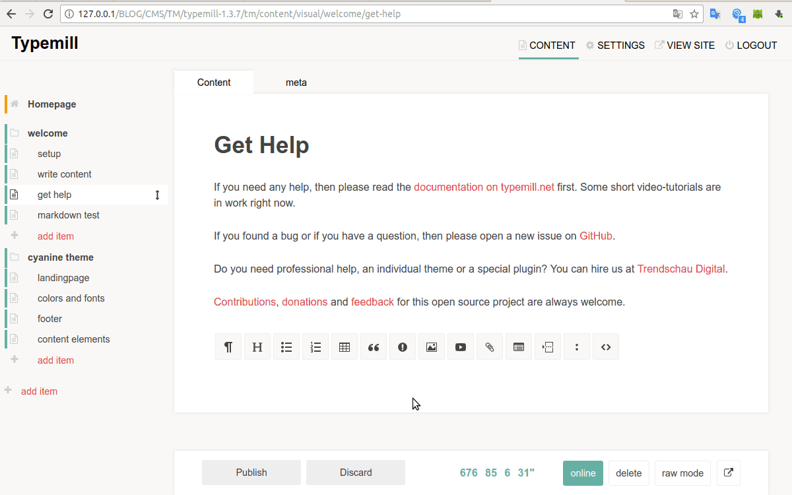

# About typemill-counter

The `counter` is a plugin that counts characters, words, sentences and reading time even when typing for [Typemill](https://github.com/typemill/typemill)

## Features

This plugin works:
* in the admin environment
* both in raw and visual environment
* with available languages: English, Italian

## Requirements

* A working installation of TYPEMILL downloadable from [Typemill](https://typemill.net/).

## How to install

* Download the [Typemill CMS](https://typemill.net/)
* Download this plugin (zip).
* Unzip the plugin.
* Upload the plugin to the plugin-folder of your Typemill installation.
* Login to your Typemill installation.
* Go to settings -> plugins and activate your plugin.

## Documentation

The plugin works exclusively in the administrator environment, both in raw and in visual mode.

The counters show the values of the current page and are updated when editing the page.

To display the counter of characters, words, phrases and reading time in the bottom bar, enable the plugin. For the reading speed it is possible to change the default value set to 160 words per minute.

## TO DO

Count the characters, words, sentences and reading time of the whole site.

## Licence and Credits

Typemill-counter is published under MIT licence. Please check the licence of the included libraries, too.

## How to Contribute

Here are some contribution-ideas for non-coder:

* Find bugs and errors (open a new issue on github for it).

Some ideas for devs (please fork this repository make your changes and create a pull request):

* Fix a bug.
* Add the file of your language.

For hints, questions, problems and support, please open up a new issue on GitHub.

## Support

This is an open source project. You can support this project with a donation.

Donate: https://paypal.me/diamante71